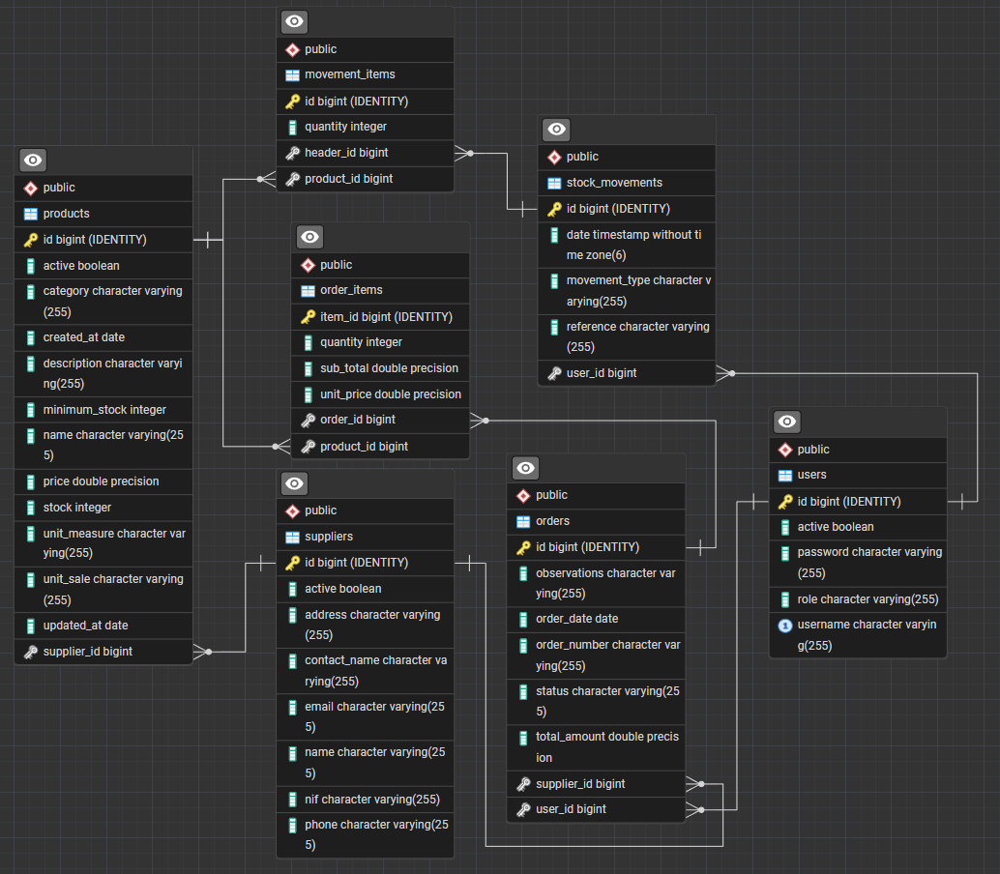

<div align="center">

# Merkand API - Sistema de Gestión de Inventario 🚀

**[English](README.md) | [Español](README.es.md)**

[](https://openjdk.org/)
[](https://spring.io/projects/spring-boot)
[](https://www.h2database.com/)
[](https://mapstruct.org/)
[](https://swagger.io/)
[](LICENSE)
</div>

> Una API REST robusta construida con **Spring Boot 4.0** para la gestión de inventario y órdenes de compra a proveedores en entornos minoristas. Diseñada como sistema interno para empleados, con foco en productividad, control y auditabilidad.

> [!IMPORTANT]
> Esta API funciona en conjunto con el frontend [Merkand-Client](https://github.com/FadiDaniel/Merkand-client) desarrollado con Angular 21.

---

## 🎯 Objetivos del Sistema

- **Control Interno de Inventario** - Seguimiento y gestión del stock en tiempo real
- **Automatización de Compras** - Proceso simplificado de órdenes de reabastecimiento
- **Auditoría de Movimientos** - Historial completo de movimientos de stock
- **Alertas de Stock Bajo** - Avisos proactivos de inventario
- **Analítica de Datos** - Reportes completos para la toma de decisiones

---

## ✨ Características Principales

### Funcionalidad Central
- 🔐 **Autenticación JWT** - Autenticación segura basada en tokens
- 👥 **Gestión de Usuarios** - Control de acceso basado en roles (Admin/Operador)
- 📦 **Gestión de Productos** - Operaciones CRUD completas para el inventario
- 🏪 **Gestión de Proveedores** - Seguimiento y administración de vendedores
- 📋 **Órdenes de Compra** - Creación y seguimiento de pedidos a proveedores
- 🔄 **Movimientos de Stock** - Registro de transacciones de ENTRADA/SALIDA/AJUSTE
- 📊 **Reportes Básicos** - Analítica e información del inventario

### Roles de Usuario

| Rol | Descripción | Capacidades |
|-----|-------------|-------------|
| **ADMIN** | Administrador del sistema | Acceso completo al sistema, creación y gestión de usuarios |
| **OPERATOR** | Operaciones diarias | Operaciones de inventario, gestión de órdenes y movimientos de stock |

> [!NOTE]
> Los usuarios **ADMIN** deben crearse directamente en la base de datos. Los usuarios **OPERATOR** son creados por los administradores a través de la aplicación.

---

## 🏗️ Arquitectura y Diseño

### Stack Tecnológico
- **Java 21** - Última versión LTS con características modernas (Records, Pattern Matching, etc.)
- **Spring Boot 4.0.0** - Framework de aplicaciones empresariales
- **Spring Data JPA** - ORM y abstracción de base de datos
- **Spring Security** - Autenticación y autorización
- **JWT** - Tokens de autenticación sin estado
- **H2 Database** - Base de datos en memoria para desarrollo y pruebas
- **Maven** - Gestión de dependencias y herramienta de construcción
- **MapStruct 1.6.2** - Mapeo de objetos tipado y seguro en tiempo de compilación (reemplaza a ModelMapper)
- **Springdoc OpenAPI 2.3.0** - Swagger UI para documentación de la API
- **Lombok** - Reducción de código repetitivo (utilizado en entidades)
- **Validation (Bean Validation 3.x)** - Anotaciones de validación integradas en los DTOs

### Arquitectura por Capas

Aplicación monolítica modular con capas bien definidas:

```
src/main/java/com/merkand/api/
├── config/          # Clases de configuración (Security, CORS, OpenAPI, DataInitializer)
├── controller/      # Endpoints REST
├── service/         # Capa de lógica de negocio
├── repository/      # Capa de acceso a datos (JPA)
├── entity/          # Entidades JPA
├── dto/             # Objetos de Transferencia de Datos (Records de Java 21 con validación)
├── mapper/          # Interfaces de mapeo con MapStruct
├── exception/       # Excepciones personalizadas y GlobalExceptionHandler
└── security/        # Filtros y utilidades JWT
```

Cada capa tiene responsabilidades claramente definidas:
- **Controllers** - Gestionan las peticiones/respuestas HTTP
- **Services** - Implementan la lógica de negocio
- **Repositories** - Operaciones con la base de datos
- **Entities** - Mapeos de tablas de la base de datos
- **DTOs** - Estructuras de petición/respuesta de la API (usando Records de Java 21)
- **Mappers** - Conversión tipada y segura entre entidades y DTOs (MapStruct)

---

## 🏗️ Estado actual del ERM



## 🔐 Seguridad

### Flujo de Autenticación
1. El cliente envía credenciales a `/api/auth/login`
2. El servidor valida y devuelve un token JWT
3. El cliente incluye el token en la cabecera `Authorization: Bearer <token>`
4. El servidor valida el token en cada petición

### Endpoints Protegidos
Todos los endpoints requieren autenticación excepto:
- `POST /api/auth/login` - Autenticación de usuarios
- `POST /api/auth/register` - Registro de usuarios (solo Admin)
- Documentación Swagger UI: `/swagger-ui.html`, `/v3/api-docs/**` (públicos para desarrollo/pruebas)

### Roles y Permisos
- **ROLE_ADMIN** - Acceso completo al sistema
- **ROLE_OPERATOR** - Acceso operacional limitado

### Características de Seguridad Adicionales
- Codificación de contraseñas con BCrypt
- Expiración de tokens configurada (24 horas)
- Manejador de Acceso Denegado personalizado para respuestas 403 consistentes
- Manejador Global de Excepciones para respuestas de error estandarizadas
- CORS configurado para permitir el frontend desde `http://localhost:4200`

---

## 🚀 Primeros Pasos

### Requisitos Previos
- **Java 21** o superior
- **Maven 3.9+**
- **Git**
- **Docker** (opcional, para implementación en contenedores)

### Instalación y Ejecución

### Opción 1: Ejecución Local (Sin Docker)
[Ir a opcion con Docker 🐳](#opción-2-ejecución-con-docker-)

1. **Clonar el repositorio**
   ```bash
   git clone https://github.com/FadiDaniel/Merkand-API.git
   cd Merkand-API
   ```

2. **Configurar variables de entorno en `application.yml`**
   ```yaml
   key: JWT_SECRET=tu-clave-secreta-aqui
   ```

3. **Compilar el proyecto**
   ```bash
   mvn clean install
   ```

4. **Ejecutar la aplicación**
   ```bash
   # Con Maven (recomendado para desarrollo)
   mvn spring-boot:run
   
   # O usando el JAR generado
   java -jar target/merkand-api.jar
   ```

### Opción 2: Ejecución con Docker 🐳

1. **Clonar el repositorio**
   ```bash
   git clone https://github.com/FadiDaniel/Merkand-API.git
   cd Merkand-API
   ```

2. **Construir la imagen Docker**
   ```bash
   docker build -t merkand-api .
   ```

3. **Ejecutar con Docker Compose **
   ```bash
   docker-compose up -d
   ```

4. **O ejecutar de forma independiente **
   ```bash
   docker run -p 8080:8080 \
     -e JWT_SECRET=tu-secreto \
     merkand-api
   ```

### Acceso a la API

Una vez que la aplicación esté en ejecución:

- **API Principal**: http://localhost:8080
- **Documentación interactiva de Swagger UI**: http://localhost:8080/swagger-ui.html

- **Especificación OpenAPI JSON**: http://localhost:8080/v3/api-docs
- **Especificación OpenAPI YAML**: http://localhost:8080/v3/api-docs.yaml

[📖 Ir a la documentacion interactiva](#-documentación-de-la-api)

> [!NOTE]
> Los endpoints de autenticación (`/api/auth/*`) son públicos. Todos los demás endpoints requieren autenticación JWT.

---

---

## 📖 Comprobar permanencia en la base de datos H2
> 💡 **Nota sobre los datos**: La aplicación cuenta con un componente de inicialización automática (*Data Seeding*) que puebla la base de datos con tareas de ejemplo al arrancar. Esto permite que los endpoints sean funcionales y testeables desde el primer segundo sin necesidad de cargas manuales.
#### `http://localhost:8080/h2-console`
####   Confirma que la URL de conexión es correcta, probar conexión y luego conectar.


#### Una vez conectado, ejecuta una consulta simple para comprobar que la tabla se inicializó con datos.


---

## ⚙️ Configuración

### Propiedades de la Aplicación
Configuraciones clave en `application.properties` o `application.yml`:

```yaml
spring:
  datasource:
    url: jdbc:h2:mem:merkanddb;DB_CLOSE_DELAY=-1;DB_CLOSE_ON_EXIT=FALSE
    driver-class-name: org.h2.Driver
    username: sa
    password:
  jpa:
    hibernate:
      ddl-auto: update
    show-sql: false
    database-platform: org.hibernate.dialect.H2Dialect

jwt:
  secret: ${JWT_SECRET}
  expiration: 86400000  # 24 horas

server:
  port: 8080
```

### Variables de Entorno

| Variable | Descripción | Requerida |
|----------|-------------|-----------|
| `JWT_SECRET` | Clave secreta para firma de JWT | ✅ Sí |

---

## 🧪 Pruebas

El proyecto incluye una estrategia de pruebas integral inspirada en el proyecto api-tareas:

### Tipos de Pruebas
- **Pruebas Unitarias** - Usando JUnit 5, Mockito y AssertJ
- **Pruebas de Integración** - Usando @SpringBootTest (pueden añadirse)
- **Cobertura de Pruebas** - Objetivo >80% con Jacoco

### Ejecución de Pruebas
```bash
# Ejecutar pruebas unitarias
mvn test

# Ejecutar pruebas de integración (si están configuradas)
mvn verify

# Generar informe de cobertura
mvn jacoco:report
```

### Mejoras en las Pruebas
- Pruebas unitarias completas para la capa de servicios (ejemplo: ProductServImplTest)
- Uso de Mockito para el mock de dependencias
- AssertJ para aserciones fluidas
- Inicialización de datos de prueba mediante el componente @DataInitializer

---

## 📦 Despliegue

### Construcción para Producción
```bash
mvn clean package -DskipTests
```

El archivo JAR estará disponible en `target/merkand-api.jar`

### Soporte Docker
El proyecto incluye soporte Docker para despliegue en contenedores:

#### Dockerfile
Se proporciona un Dockerfile multi-etapa para construcciones optimizadas:
- Usa una etapa de construcción con Maven para compilar la aplicación
- Usa el runtime de OpenJDK 21 para minimizar el tamaño de la imagen
- Se ejecuta como usuario no-root por seguridad
- Incluye endpoint de health check

#### docker-compose.yml
Para un desarrollo local sencillo (sin base de datos externa requerida):
```yaml
version: '3.8'

services:
  merkand-api:
    build: .
    ports:
      - "8080:8080"
    environment:
      - JWT_SECRET=tu-clave-secreta-aqui
```

#### Construcción y Ejecución
```bash
# Construir la imagen Docker
docker build -t merkand-api .

# Ejecutar con Docker Compose (no se requiere base de datos externa)
docker-compose up -d

# O ejecutar un contenedor Docker independiente (usa base de datos en memoria H2)
docker run -p 8080:8080 \
  -e JWT_SECRET=tu-secreto \
  merkand-api
```

---

## 📖 Documentación de la API

### Swagger UI
Documentación interactiva de la API disponible en:
```
http://localhost:8080/swagger-ui.html
```

### OpenAPI JSON/YAML
Especificación completa disponible en:
- JSON: `http://localhost:8080/v3/api-docs`
- YAML: `http://localhost:8080/v3/api-docs.yaml`

### Endpoints Principales (Ejemplos)

<details>
<summary><b>Autenticación</b></summary>

```http
POST /api/auth/login
Content-Type: application/json

{
  "username": "test01",
  "password": "test01"
}
```

Respuesta:
```json
{
  "token": "eyJhbGciOiJIUzI1NiIsInR5cCI6IkpXVCJ9...",
  "type": "Bearer",
  "username": "test01",
  "role": "ROLE_ADMIN"
}
```

`POST /api/auth/register` (solo ADMIN)
```json
{
  "username": "nuevousuario",
  "password": "nuevacontraseña"
}
```
</details>

<details>
<summary><b>Productos</b></summary>

```http
GET    /api/products          # Listar todos los productos
GET    /api/products/{id}     # Obtener producto por ID
POST   /api/products          # Crear nuevo producto
PUT    /api/products/{id}     # Actualizar producto
DELETE /api/products/{id}     # Eliminar producto
```
</details>

<details>
<summary><b>Órdenes</b></summary>

```http
GET    /api/orders            # Listar todas las órdenes
GET    /api/orders/{id}       # Obtener orden por ID
POST   /api/orders            # Crear nueva orden
PUT    /api/orders/{id}       # Actualizar orden
```
</details>

<details>
<summary><b>Proveedores</b></summary>

```http
GET    /api/suppliers         # Listar todos los proveedores (solo Admin)
POST   /api/suppliers         # Crear proveedor (solo Admin)
PUT    /api/suppliers/{id}    # Actualizar proveedor (solo Admin)
DELETE /api/suppliers/{id}    # Eliminar proveedor (solo Admin)
```
</details>

<details>
<summary><b>Movimientos de Stock</b></summary>

```http
GET    /api/movements         # Listar todos los movimientos de stock
GET    /api/movements/{id}    # Obtener movimiento por ID
POST   /api/movements         # Registrar nuevo movimiento
PUT    /api/movements/{id}    # Actualizar movimiento
```
</details>

---

## 💡 Mejoras Recientes

Esta versión incorpora varias buenas prácticas modernas:

- **DTOs como Records de Java 21** - Reducción significativa de código repetitivo
- **Bean Validation en DTOs** - Validación declarativa (@NotBlank, @Positive, @Email, etc.)
- **MapStruct para Mapeo Tipado** - Conversión entidad-DTO verificada en tiempo de compilación
- **Manejador Global de Excepciones** - Respuestas de error consistentes en todos los endpoints
- **Tipos de Excepciones Personalizados** - ResourceNotFound, ValidationException, BusinessException
- **Inicialización Automática de Datos** - El componente DataInitializer carga datos de prueba al arrancar (perfiles dev/test)
- **Integración Swagger/OpenAPI** - Documentación interactiva de la API con soporte de autenticación JWT
- **Pruebas Unitarias Mejoradas** - Pruebas completas de la capa de servicios con Mockito/JUnit 5
- **Respuestas de Error Estandarizadas** - Incluyen estado HTTP, mensaje y marca de tiempo
- **Configuración CORS** - Correctamente configurado para el frontend Angular

---

## 🗺️ Hoja de Ruta

- [x] Añadir soporte para múltiples roles y permisos de usuario
- [x] Crear configuración Docker Compose para desarrollo local sencillo
- [x] Añadir pruebas unitarias completas para repositorios
- [ ] Implementar limitación de tasa para prevenir abusos
- [ ] Mejorar los reportes con analítica avanzada
- [ ] Implementar carga/descarga de archivos para imágenes/documentos de productos
- [ ] Implementar paginación para controlar el envío de datos al frontend

---

## 🔗 Proyectos Relacionados

- **[Merkand-Client](https://github.com/FadiDaniel/Merkand-client)** - Aplicación frontend Angular 21

---

## 📄 Licencia

Consulta el archivo [LICENSE](LICENSE) para más detalles.

---

## 👨‍💻 Autor

**Fadi**
- GitHub: [@FadiDaniel](https://github.com/FadiDaniel)

---

<div align="center">
  <p>Construido con ☕ usando Spring Boot</p>
</div>